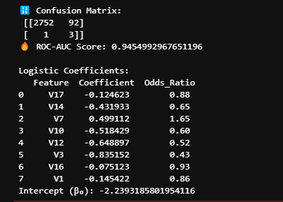
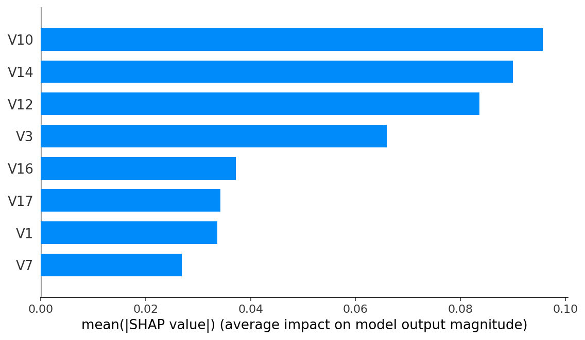
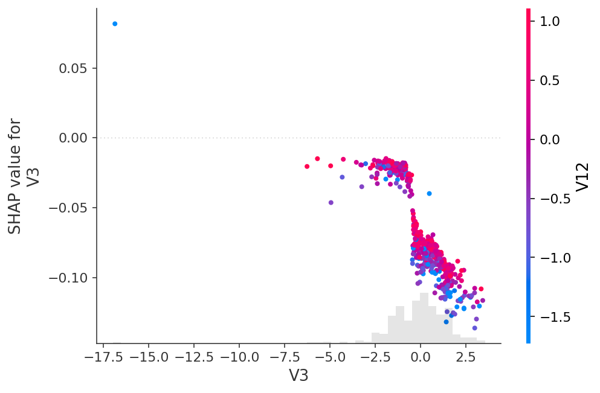
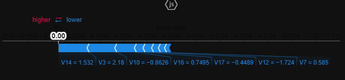

# Credit Card Fraud Detection

End-to-end analysis of Kaggle’s [Credit Card Fraud Detection](https://www.kaggle.com/mlg-ulb/creditcardfraud) dataset: from EDA to model training and SHAP interpretability.

[]()  
[]()

---

## 📁 Repository Structure

```
.
├── data/                      # raw data (not checked in)
│   └── creditcard.csv
├── figures/                   # exported plots (.png)
│   ├── time_distribution.png
│   ├── class_distribution.png
│   ├── logamount_by_class.png
│   ├── correlation_heatmap.png
│   ├── logistic_coefficients.png
│   ├── shap_summary_bar.png
│   ├── shap_dependence_v3_v12.png
│   └── shap_force_example.png
├── notebooks/                 
│   └── fraud_analysis.ipynb   # combined EDA, modeling & SHAP
├── requirements.txt           # pip dependencies
└── README.md                  # this file
```

---

## 🚀 Quickstart

1. **Clone the repo**  
   ```bash
   git clone https://github.com/yourusername/credit-fraud-analysis.git
   cd credit-fraud-analysis
   ```

2. **Install dependencies**  
   ```bash
   python3 -m venv venv
   source venv/bin/activate       # Windows: .\venv\Scripts\activate
   pip install -r requirements.txt
   ```

### 3. Download the data  
1. Sign in to Kaggle and download `creditcard.csv` from the dataset page.  
2. Place the file at `data/creditcard.csv` in this repo.

4. **Launch Jupyter**  
   ```bash
   jupyter lab
   ```  
   - Open **`fraud_analysis.ipynb`** for the full workflow.

---

## 📊 Part 1: EDA & Logistic Regression

1. **Subsample 5 %** of data for fast iteration  
2. **EDA**: transaction time distribution, class imbalance, log-amount density  
3. **Feature selection**: Pearson correlation (|ρ| > 0.1)  
4. **Logistic regression** with `class_weight="balanced"`

**Key results**  
- **ROC-AUC** ≈ 0.945  
- **Top negative drivers**: V3 (OR 0.43), V12 (OR 0.52), V10 (OR 0.60), V14 (OR 0.65)  
- **Positive driver**: V7 (OR 1.65)  



---

## 🌳 Part 2: Random Forest + SHAP

1. **Subsample 50 %**, then **SMOTE** to balance the fraud class  
2. Train `RandomForestClassifier(n_estimators=100, random_state=42)`  
3. Compute SHAP on a 500-row slice:  
   - **Global feature importance** (bar plot)  
   - **Dependence plot**: SHAP(V3) vs V3, colored by SHAP(V12)  
   - **Force plot** for a single sample  

  
  


---

## 🔭 Next Steps

- **Threshold tuning** (precision–recall tradeoff)  
- **Additional feature engineering** (time buckets, amount flags)  
- **Ensemble sampling** or **cost-sensitive methods**  
- **Deployment**: real-time scoring, monitoring drift  

---

## 🛠 Requirements

```text
python>=3.8
pandas
numpy
scikit-learn
imbalanced-learn
matplotlib
seaborn
shap
jupyterlab
```

Install with:
```bash
pip install -r requirements.txt
```

---

## 📜 License

This project is licensed under the [MIT License](LICENSE).

---

**Author**: Luke W  
**Created**: Apr 22 2025  

